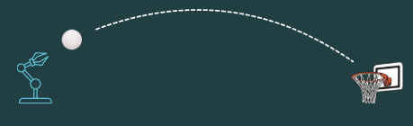

<div align="center">

# DEEP HOOP | Robotic Hoop Throw

</div>

<p align="center" width="100%">
  
</p>

<div align="center">
  <a>
    
  </a>
  <a>
    
  </a>
  <a>
    
  </a>
</div>

<br/>

## Project Overview

**DEEP HOOP** is a custom Webots‐based reinforcement learning project in which a robotic arm learns to throw a ball through a hoop. It leverages:

* A **Supervisor environment** built on **DeepBots** to interface Webots with Gym.
* Multiple **reward functions**:
  * Dense, velocity-shaped reward
  * Sparse success reward
  * Sparse distance reward

* **Curriculum learning** that automatically increases difficulty (hoop position & size) as the agent’s performance improves.
* **Evaluation callbacks** to record detailed metrics (success rate, distances, throw dynamics).
* Support for **PPO**, **SAC**, and **HER** algorithms via Stable-Baselines3.

This setup enables systematic training (with checkpoints & TensorBoard), curriculum progression, and post-training evaluation at varying difficulty levels.

## Installation

1. **Clone the repository**

   ```bash
   git clone https://github.com/yourusername/webots-baller.git
   cd webots-baller
   ```

2. **Install Webots R2023B**
   Download & install from the [Cyberbotics website](https://cyberbotics.com) and ensure the `webots` executable is in your PATH.

3. **Set up a Python 3.10.12 environment**

   ```bash
   python3.10 -m venv venv
   source venv/bin/activate
   pip install --upgrade pip
   ```

4. **Install Python dependencies**

   ```bash
   pip install -r requirements.txt
   ```

## Usage

### Launch Webots & Supervisor Controller

1. **Open the Webots world**

   ```bash
   webots worlds/hoop_throw.wbt
   ```
2. **Run the supervisor controller**
   In the Webots GUI, select the `supervisor_controller.py` as your controller for the `Supervisor` node.

### Training

Run the `supervisor_controller.py` script directly from within PyCharm. Upon launch, it will automatically connect to a running Webots instance, just make sure Webots R2023B is open with the `puma560_new.wbt` world loaded and running.

At the top of `supervisor_controller.py`, you can switch the training algorithm by setting the `TRAIN_ALG` variable (options: `ppo`, `sac`, or `her`).

During training, checkpoints and logs are stored as follows:

* **Models:** Saved every 50,000 steps to `./models/` with filenames formatted as `<algo>_<rew_fun>_step_<n>.zip`.
* **TensorBoard logs:** Written to `./logs/`, in subdirectories named after each run (e.g., `ppo_shaped`).

### Evaluation

1. **Disable Training Mode**

At the top of `supervisor_controller.py`, set:

```python
TRAINING = False
```

2. **Place Your Trained Model**

Copy your trained model into the `./trained_models/` directory.

3. **Run the Script**

Launch `supervisor_controller.py` from your IDE (PyCharm will auto-connect to Webots)

This will run evaluation episodes using your saved policy.

4. **Review the Results**

* **Evaluation metrics** (per-episode success rate, distances, etc.) are logged to `./evaluation/<algo>_<with|without>_curriculum/` as CSV and TensorBoard event files.


## Demo

Below is a short demonstration of a trained PPO agent (maximum difficulty):

<div align="center">
  <video src="./vids/ppo_no_curriculum.mp4" controls width="60%"></video>
</div>

Enjoy watching the handy robot master its throw!