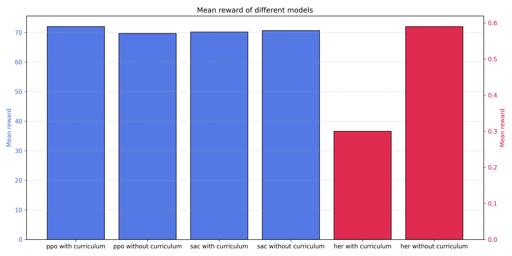
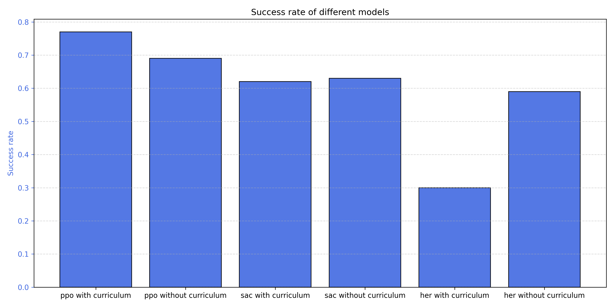

<div align="center">

# DEEP HOOP | Robotic Hoop Throw

</div>

<p align="center" width="100%">
  
</p>

<div align="center">
  <a>
    
  </a>
  <a>
    
  </a>
  <a>
    
  </a>
</div>

<br/>

## Project Overview

**DEEP HOOP** is a custom Webots‐based reinforcement learning project in which a robotic arm learns to throw a ball through a hoop. It leverages:

* A **Supervisor environment** built on **DeepBots** to interface Webots with Gym.
* Multiple **reward functions**:
  * Dense, velocity-shaped reward
  * Sparse success reward
  * Sparse distance reward

* **Curriculum learning** that automatically increases difficulty (hoop position & size) as the agent’s performance improves.
* **Evaluation callbacks** to record detailed metrics (success rate, distances, throw dynamics).
* Support for **PPO**, **SAC**, and **HER** algorithms via Stable-Baselines3.

This setup enables systematic training (with checkpoints & TensorBoard), curriculum progression, and post-training evaluation at varying difficulty levels.

The following table lists the core software packages and versions used in this work:

### Software Packages

| **Package**         | **Version** |
|---------------------|-------------|
| Webots              | R2023b      |
| Python              | 3.10.12     |
| deepbots            | 1.0.0       |
| stable-baselines3   | 2.6.0       |
| numpy               | 2.2.3       |
| torch               | 2.6.0       |
| gym                 | 0.21.0      |


## Installation

This project is compatible with Linux 20.04.6 LTS (Focal Fossa) operating systems but newer version should also work.

1. **Clone the repository**

   ```bash
   git clone https://github.com/inesamorim/deep-hoop.git
   cd webots-baller
   ```

2. **Install Webots R2023B**
   Download & install from the [Cyberbotics website](https://cyberbotics.com) and ensure the `webots` executable is in your PATH.

3. **Set up a Python 3.10.12 environment**

   ```bash
   python3.10 -m venv venv
   source venv/bin/activate
   pip install --upgrade pip
   ```

4. **Install Python dependencies**

   ```bash
   pip install -r requirements.txt
   ```

## Environment Configuration

The initial configuration of the environment is defined by the spatial coordinates of key objects and the angular positions of the robot’s joints. The table below summarizes the initial positions of the robot base, ball, and hoop in three-dimensional space (x, y, z), as well as the initial one-dimensional joint angles for the arm and gripper. While position values are expressed in meters, joint values are given in radians and correspond to angular displacements around each joint's rotation axis.

### Initial Positions and Joint Angles

| **Element**          | **Initial Position / Value**     |
|----------------------|----------------------------------|
| Robot base position  | (0.000, 0.000, 0.000)            |
| Ball position        | (-0.059, -0.038, 0.770)          |
| Hoop position        | Variable\*                       |
| Joint 1 (Shoulder)   | 0.200 rad                        |
| Joint 2 (Upperarm)   | -0.950 rad                       |
| Joint 3 (Wrist2)     | 3.150 rad                        |
| Gripper Joint 1      | 0.450 rad                        |
| Gripper Joint 2      | 0.500 rad                        |
| Gripper Joint 3      | 0.500 rad                        |

Position values are in meters. Joint values are in radians.

## Algorithms Implementation

### PPO

- **Policy updates**: Performed every 2048 environment steps
- **Learning Rate**: $3 \times 10^{-4}$ (Adam optimizer)
- **Clipping Parameters**: $\epsilon = 0.2$
- **Generalized Advantage Estimation**: $\lambda = 0.95$, $\gamma = 0.99$
- **Training**: 1 million total timesteps
- **Network architecture**: Two hidden layers (64 units each) with ReLU activation

### SAC

- **Learning rate**: $3 \times 10^{-4}$ (Adam optimizer for both policy and critics)
- **Batch size**: 256 (HER-compatible default)
- **Target smoothing ($\tau$)**: 0.005
- **Temperature ($\alpha$)**: Automatically tuned with initial value 0.2
- **Target entropy**: $-\dim(\mathcal{A})$ (action space dimension)
- **Training duration**: $10^7$ timesteps (consistent with HER implementation)
- **Network architecture**: Twin Q-networks (256$\times$256) with ReLU

### HER

- **Goal sampling**: Final-state relabeling strategy ($n_{\text{sampled\_goal}}=4$)
- **Replay buffer**: 1M transition capacity
- **Exploration**: Ornstein-Uhlenbeck noise ($\sigma=0.1$)
- **Training duration**: $10^7$ timesteps ($\approx1000$ episodes at $10^4$ steps/episode)

## Usage

### Launch Webots & Supervisor Controller

1. **Open the Webots world**

   ```bash
   webots worlds/PUMA560_new.wbt
   ```
2. **Run the supervisor controller**
   In the Webots GUI, select `extern` as your controller for the `PUMA 560` node.

### Training

You have two options depending on whether you want to train a single model or run batch experiments:

#### 🔹 `supervisor_controller.py`

* Best suited for **training a single model**.
* Simple to configure and launch.
* Edit the script to set:

  * `TRAIN_ALG = 'ppo'` (options: `ppo`, `sac`, `her`)
  * `USE_CURRICULUM = True/False`

#### 🔹 `bulk_train.py`

* Recommended if you want to **train multiple models** with different settings (e.g., different algorithms, seeds, curriculum).
* Automatically manages multiple runs and directories.

> Ensure Webots is open and running the `puma560_new.wbt` world before launching either script.

Checkpoints and logs:

* **Model checkpoints and logs**: Saved to `./runs/` one subfolder per run


### Evaluation

1. **Disable Training Mode**

In either script, set:

```python
TRAINING = False
```

2. **Run the evaluation script**

Execute `supervisor_controller.py` or `bulk_train.py` again. It will run multiple test episodes using your policy.

3. **Review the Results**

Evaluation metrics are logged to:

```
./evaluation/<algo>_<with|without>_curriculum/
```

Output is available as CSV files and TensorBoard logs.

---

## Results

### Evaluation Plots

<div align="center">
  
</div>

<div align="center">
  
</div>

---

## Demo

Below is a short demonstration of a trained PPO agent (maximum difficulty):

<div align="center">
  <video src="./vids/ppo_no_curriculum.mp4" controls width="60%"></video>
</div>

Enjoy watching the handy robot master its throw!
